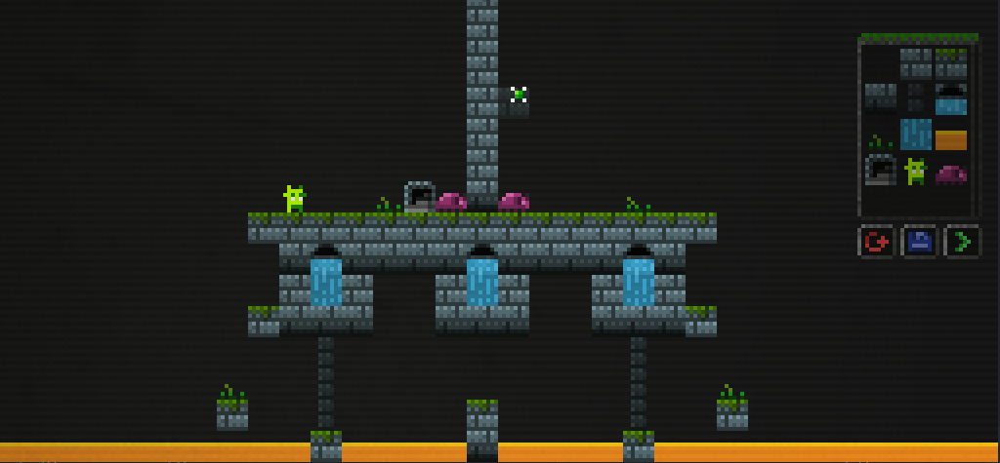

# Another Kind of World (Remake)

Another Kind of World is a minimalistic 2D platformer game originally created for the Ludum Dare 23 game jam submitted by [Markus Kothe](https://github.com/daandruff) (aka daandruff).

You can find the original game jam version [here](https://love2d.org/forums/viewtopic.php?p=263934#p263934).

# Running

You can find pre-packaged game releases in the [Releases](https://github.com/MadByteDE/Another-Kind-of-World-Remake/releases) tab.

To package and run from source, please follow the instructions on the [LÖVE Getting started page](https://love2d.org/wiki/Getting_Started).

# License

AKOW's core code and extension modules are licensed under the terms of the
**GNU GPLv3** license.

AKOW's art, music and other assets are licensed under the terms of the
**CC-BY-SA-3.0** license.

Check out [AUTHORS.txt](./AUTHORS.txt) for more details.

